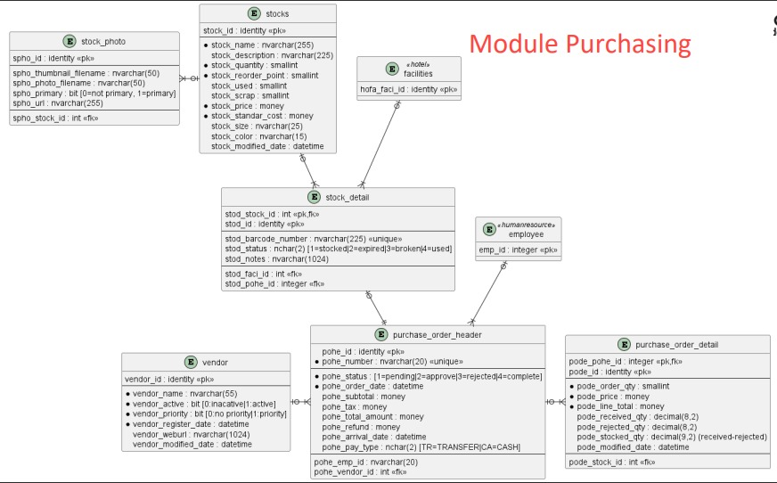

# PURCHASING MODULE

## Daftar Tabel
- stocks
- stock_photo
- stock_detail
- purchase_order_header
- purchase_order_detail
- vendor

## Clustered Primary Key
- stock_detail : stod_stock_id
- purchase_order_detail : pode_pohe_id

## Trigger 
(*) ph_subtotal: Kolom ini harus dihitung secara otomatis berdasarkan jumlah total harga produk yang dipesan.
[ ] ph_tax: Kolom ini harus dihitung secara otomatis berdasarkan tarif pajak yang berlaku.
ph_total_amount: Kolom ini harus dihitung secara otomatis berdasarkan ph_subtotal ditambah ph_tax.
pd_line_total: Kolom ini harus dihitung secara otomatis berdasarkan pd_order_qty dikali pd_price. 